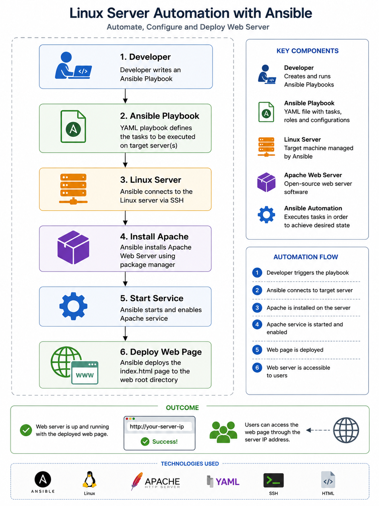

# Linux and Ansible Automation

## Architecture Diagram



## Overview

This project demonstrates the use of Ansible to automate Linux server configuration and application deployment.

## Architecture

```text
Ansible
   ↓
Playbook
   ↓
Linux Server
   ↓
Apache Installation
   ↓
Service Configuration
   ↓
Web Application
```

## Services and Tools Used

- Linux
- Ubuntu
- Ansible
- Apache
- YAML
- SSH
- Systemd

## What This Project Demonstrates

This project demonstrates the ability to automate server configuration using Infrastructure as Code principles.

Key capabilities demonstrated include:

- Creating Ansible playbooks
- Automating package installation
- Managing Linux services
- Automating web server deployment
- Configuring Apache
- Creating custom web content
- Applying idempotent configuration management
- Using privilege escalation with Ansible

## Project Structure

```text
playbooks/
└── install-apache.yml
```

## Key Learning Outcomes

Through this project, I gained hands-on experience with:

- Linux administration
- Configuration management
- Ansible playbooks
- YAML syntax
- Service management
- Infrastructure automation
- Idempotent deployments

## Validation

The playbook successfully installed Apache, started and enabled the service, and deployed a custom web page.

The playbook was re-run multiple times to verify idempotent behaviour, ensuring that no unnecessary changes were made when the desired state already existed.